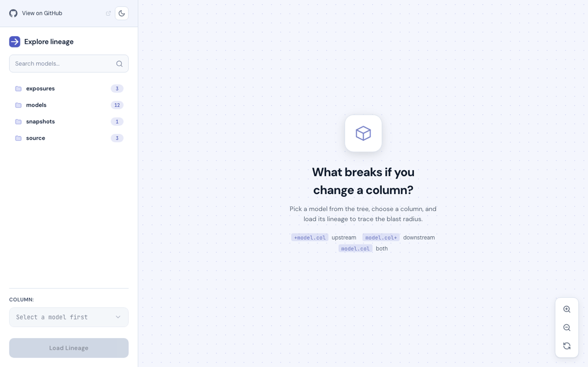
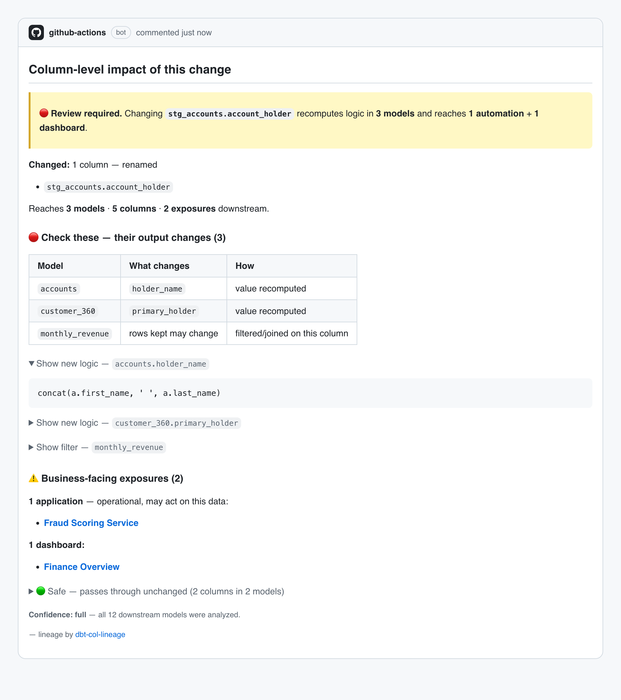
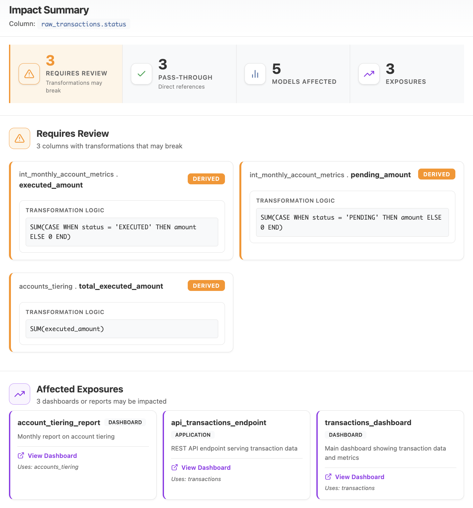

# dbt-col-lineage

**Know what breaks before you change it.** Column-level lineage and change-impact
analysis for dbt — answer *"what breaks if I change this column?"* in seconds,
without ever running your warehouse.

[](https://github.com/Fszta/dbt-column-lineage/actions/workflows/test.yml)
[](https://pypi.org/project/dbt-col-lineage/)
[](https://pypi.org/project/dbt-col-lineage/)
[](https://pypi.org/project/dbt-col-lineage/)
[](LICENSE)

📖 **[Documentation](https://fszta.github.io/dbt-column-lineage/)** &nbsp;·&nbsp; 🚀 [Live Demo](https://dbt-column-lineage.onrender.com) &nbsp;·&nbsp; 🐛 [Report Bug](https://github.com/Fszta/dbt-column-lineage/issues) &nbsp;·&nbsp; 💡 [Request Feature](https://github.com/Fszta/dbt-column-lineage/issues)



---

## "I already have lineage in dbt docs."

You have *model*-level lineage. When you rename, retype, or drop a single **column**,
the dbt DAG can't tell you which downstream columns, transformations, or dashboards
actually break — it only knows model A feeds model B. That's the gap this closes.

|  | **dbt docs / DAG** | **dbt-col-lineage** |
|---|---|---|
| Lineage granularity | Model → model | **Column → column** |
| *"What breaks if I change `orders.amount`?"* | Guess from the model graph | **Exact affected columns, models & exposures** |
| Pass-through vs. real logic | ❌ | ✅ flags columns whose SQL actually recomputes the value |
| Needs a warehouse connection | `dbt docs serve` | **No — reads artifacts, runs anywhere** |
| Blast-radius check in CI | ❌ | ✅ sticky PR comment + severity gate |
| Machine-readable for AI agents | ❌ | ✅ one JSON document, built for automation |

It reads only your dbt artifacts (`manifest.json` + `catalog.json`) and parses the
compiled SQL statically with [sqlglot](https://github.com/tobymao/sqlglot).
**It never connects to your warehouse and never runs dbt models.**

---

## Comment the blast radius on every dbt PR

Point it at CI and it posts a **sticky comment on the pull request** showing exactly
what a change breaks — the downstream models, columns, and business-facing **exposures**
(dashboards, apps) it touches — so every reviewer sees the impact before they approve.
Optionally **fail the check** when a change is too risky.



Add it as a GitHub Action:

```yaml
# .github/workflows/impact.yml
permissions:
  pull-requests: write        # so the check can post its comment

# ...build base- and head-branch dbt artifacts, then:
- uses: Fszta/dbt-column-lineage@v0
  with:
    manifest: artifacts/head/manifest.json
    catalog: artifacts/head/catalog.json
    base-manifest: artifacts/base/manifest.json
    base-catalog: artifacts/base/catalog.json
    fail-on: none             # start non-blocking; flip to exposures|critical once trusted
```

**How the loop works:** a PR opens → CI builds dbt artifacts for the base and PR
branches → the action diffs them, traces every affected column, model, and exposure,
and posts **one** sticky comment (found-and-updated via a hidden marker, so re-runs
edit the same comment instead of spamming the thread).

**The severity gate (`fail-on`)** decides when an impactful change should block the PR:

| `fail-on`   | Blocks the PR when… |
|-------------|---------------------|
| `none`      | never — comment only (**default**, the safe on-ramp) |
| `tests`     | a change **provably breaks a dbt test** (removes/renames a column a `not_null`/`unique`/`relationships` test still targets) — the objective, false-positive-free level to block on (needs `base-manifest`) |
| `exposures` | a change reaches a business-facing **exposure** (dashboard / app) |
| `critical`  | a downstream column **recomputes derived logic** (not just a pass-through) |
| `any`       | any downstream column is affected at all |

The action also emits step outputs for your own gating/reporting: `affected_models`,
`affected_columns`, `affected_exposures`, `provable_breaks`, `verdict` (`safe`/`review`/`block`),
`tripped_level`, and `overrides_applied`.

**Escape hatch, not off-switch.** When the gate flags a change the author knows is fine, an
in-code **override pragma** in the head model acknowledges *that one change* with a mandatory
reason — `-- lineage:allow-change reason="…"`, or `-- lineage:allow-break reason="…"` for the
one thing that can lower a provable-break block. It lives in the PR's SQL (diffable, reviewed,
logged), so the first false positive tunes the gate instead of disarming it repo-wide. Every
honored override is surfaced in the PR comment and counted in `overrides_applied`; run
`dbt-col-lineage impact --no-overrides` (or set the action's `no-overrides: true`) to see the raw
gate. See the [override guide](https://github.com/Fszta/dbt-column-lineage/blob/main/docs/decision-engine/policy-gate.md#overriding-a-verdict-the-in-code-escape-hatch).

Pin `@v0` for updates within the current major (like `actions/checkout@v4`), or an
exact release — `@v0.13.0` — for reproducible builds. The action installs the CLI
bundled at whichever ref you pin, so the tool always matches the tag. A complete
runnable workflow lives at
[`docs/examples/impact-pr-check.yml`](docs/examples/impact-pr-check.yml).

---

## Quick start (local)

```bash
pip install dbt-col-lineage
```

Generate your dbt artifacts once — this is the only step that touches dbt, and it
still never connects to your warehouse:

```bash
dbt compile          # produces target/manifest.json
dbt docs generate    # produces target/catalog.json (column metadata)
```

Then explore your column lineage in the browser — no flags needed, it reads `target/`
by default:

```bash
dbt-col-lineage --explore
```

Open `http://127.0.0.1:8000`, pick a column, and click **Analyze Impact** to see the
columns that need review, the pass-through columns, and the affected models and
exposures. **[Try the live demo →](https://dbt-column-lineage.onrender.com)** — no
install required.



> Works even when `manifest.json` has no embedded `compiled_code` (e.g. from
> `dbt parse`), as long as `target/compiled/**` exists — it falls back to the
> compiled SQL on disk.

---

## Machine-readable output (built for agents & automation)

Emit any column's lineage and downstream impact as a **single JSON document** — a
stable contract you can pipe into an LLM tool call, a CI script, or your own tooling:

```bash
dbt-col-lineage --select stg_accounts.account_id+ --format json \
    --manifest target/manifest.json --catalog target/catalog.json
```

Selector grammar (works for `text`, `json`, and `dot` output):

| Selector | Meaning |
|---|---|
| `+model.col` | upstream only (where the value comes from) |
| `model.col+` | downstream only (what it feeds) |
| `model.col`  | both directions |

The JSON splits `upstream`/`downstream` into `models`, `sources`, `direct_refs`, and
`exposures`, plus an `impact` block summarising the affected models, columns, and
exposures. Use `--format dot` for Graphviz.

---

## Run the impact report locally

The `impact` command derives the *set* of changed columns for a branch and reports one
consolidated blast radius, ranked by severity:
**`removed` > `type_changed` > `logic_changed` > `added`**.

```bash
# Reliable two-manifest diff (base branch vs. current)
dbt-col-lineage impact \
    --manifest target/manifest.json --catalog target/catalog.json \
    --base-manifest base/manifest.json --base-catalog base/catalog.json

# Git-diff fallback when only one manifest is available
dbt-col-lineage impact --git-base main
```

It defaults to a human-readable Markdown summary (exposures first, then a blast-radius
table); add `--format json` for the machine-readable report. Add `--ci` to post the
sticky PR comment and apply the `--fail-on` gate.

---

## Beyond the blast radius: a decision engine

The impact report is the foundation; on top of it the tool now turns a PR into a **decision**,
on the principle *"diff cheaply, rebuild selectively."* All of this is additive — skip the flags
and the tool behaves exactly as before.

- **Semantic categorization** — every changed column is labelled breaking vs **provably
  cosmetic**, so a refactor that doesn't change any value doesn't get flagged.
- **A metadata-agnostic policy gate** — you author rules (`predicate → block/warn/build/test/notify`)
  over *any* dbt `meta`, the change kind, the semantic signal, and the lineage reach. The tool
  ships the engine; you ship the rules. `critical` / `pii` are example configs, never built-ins.

  ```bash
  dbt-col-lineage impact --base-manifest base/manifest.json --base-catalog base/catalog.json \
      --policy policy.yml --fail-on policy
  ```
- **Cross-boundary (Metabase) impact** — a separate credentialed `metabase-extract` step snapshots
  Metabase into `metabase_lineage.json`; the offline gate then answers *"will this column change
  break that dashboard?"* by folding dashboards into the same reach the policy engine scans.

Full guides: **[Decision Engine docs](https://fszta.github.io/dbt-column-lineage/decision-engine/overview/)**.

## Compatibility

Works with **any [sqlglot](https://github.com/tobymao/sqlglot) dialect** via `--adapter`
(auto-detected from your manifest by default). Verified against **Snowflake**,
**DuckDB**, **SQLite**, and **MS SQL Server / TSQL**; on BigQuery, Redshift, Postgres,
etc., pass `--adapter <dialect>` if auto-detection needs a nudge.

## Limitations

- Python models are not supported.
- Some SQL functions/syntax can't be parsed and cause the affected model to be skipped.

## Documentation

Full CLI reference — every flag (`--scope-git`, `--github-token`/`--repo`/`--pr-number`,
the complete `impact` surface), output formats, and CI recipes — lives at
**[fszta.github.io/dbt-column-lineage](https://fszta.github.io/dbt-column-lineage/)**.

## License

MIT — see [LICENSE](LICENSE).
