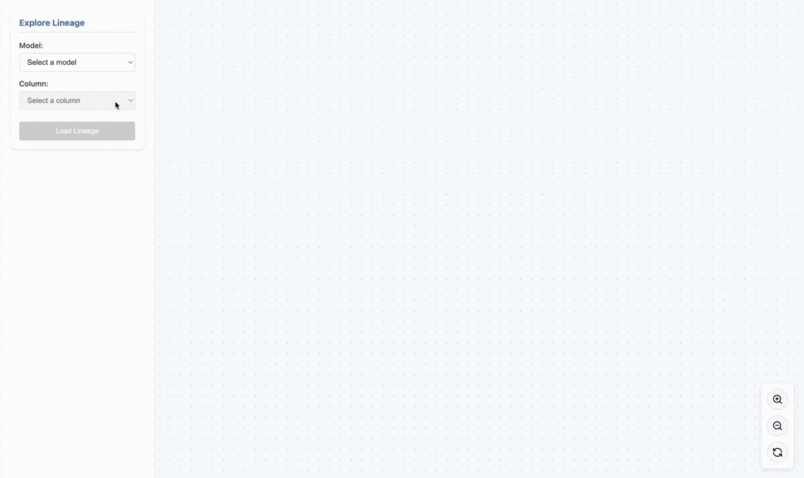

# DBT Column Lineage

[](https://github.com/Fszta/dbt-column-lineage/actions/workflows/test.yml)
[](https://pypi.org/project/dbt-col-lineage/)
[](https://pypi.org/project/dbt-col-lineage/)
[](LICENSE)

📖 **[Documentation](https://fszta.github.io/dbt-column-lineage/)** | 🚀 [Live Demo](https://dbt-column-lineage.onrender.com) | 🐛 [Report Bug](https://github.com/Fszta/dbt-column-lineage/issues) | 💡 [Request Feature](https://github.com/Fszta/dbt-column-lineage/issues)

## Overview

**Understand the impact of column changes before you make them.** DBT Column Lineage provides impact analysis & column lineage to help you answer critical questions: What happens if I change this column? Which models, transformations, and exposures will be affected? Does it use complex business logic, or is this column only projected?

The core idea behind this project: be more comfortable when making changes on a large project by knowing the impact.

**Key Features:**
- **Impact Analysis**: Understand downstream effects of column changes, including affected models, transformations, and exposures
- **Interactive Explorer**: A local web server with an intuitive UI to explore model and column lineage visually, including associated transformations





## Installation

```bash
pip install dbt-col-lineage
```

## Usage

First, ensure your dbt project is compiled and you have generated the catalog:

```bash
dbt compile
dbt docs generate
```

### Interactive Explorer

Start the interactive web interface to explore lineage and perform impact analysis:

```bash
dbt-col-lineage --explore \
    --manifest path/to/manifest.json \
    --catalog path/to/catalog.json \
    --port 8080  # Optional port selection
```

This starts a server (defaulting to port 8000). Open your web browser to the specified address (e.g., `http://127.0.0.1:8080`).

**Workflow:**
1. Select a model and column from the sidebar to visualize its lineage
2. Click **"Analyze Impact"** to see which models, transformations, and exposures will be affected if you change that column
3. Review the impact analysis panel showing:
   - Columns that require review (with transformations that may break)
   - Pass-through columns (direct references)
   - Affected models in the dependency chain
   - Affected exposures

### Options

- `--explore`: Starts the interactive web server for exploring lineage and impact analysis
- `--catalog`: Path to the dbt catalog file (default: `target/catalog.json`)
- `--manifest`: Path to the dbt manifest file (default: `target/manifest.json`)
- `--port`, `-p`: Port for the interactive web server (default: `8000`)
- `--adapter`: Override the SQL dialect used by the parser (sqlglot dialect name, e.g., `tsql`, `snowflake`, `bigquery`). When provided, this overrides the adapter detected from the dbt manifest.

## Limitations
- Doesn't support python models
- Some functions/syntax cannot be parsed properly, leading to models being skipped

## Compatibility

The tool has been tested with the following dbt adapters:
- Snowflake
- SQLite
- DuckDB
- MS SQLServer / TSQL


## License
This project is licensed under the MIT License - see the [LICENSE](LICENSE) file for details.
