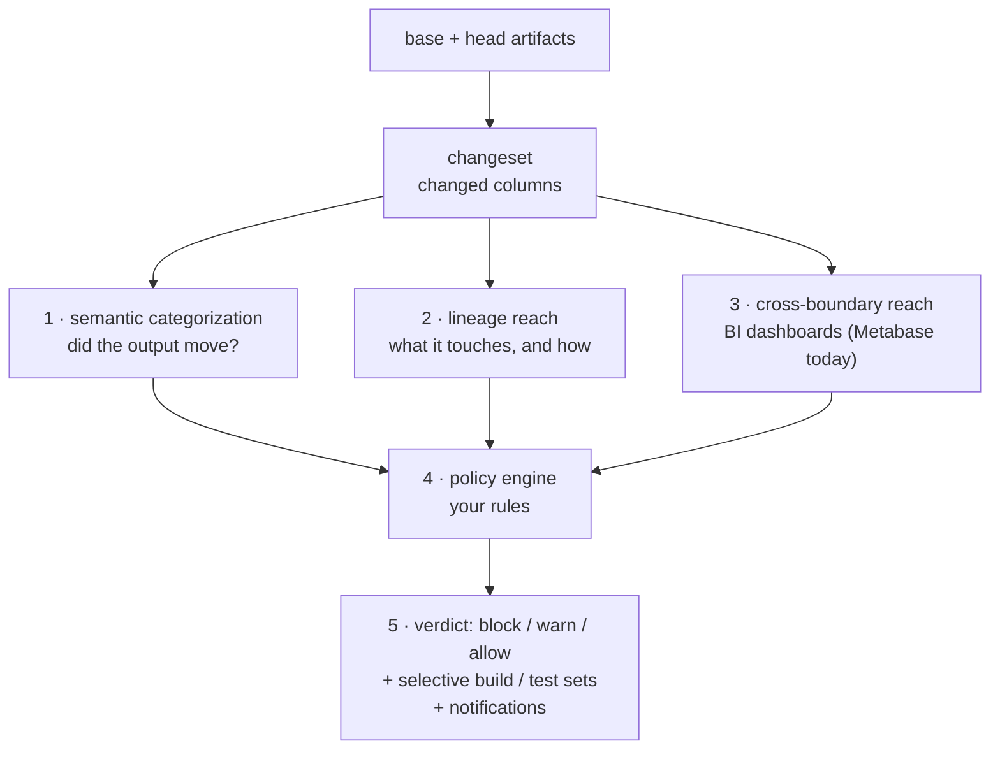

# How it works — the mental model

Read this before the how-to guides. It explains *what the decision engine is doing and why*, so
the verdicts it produces make sense (and so you don't misread them — see [Things to
know](gotchas.md)).

## The one idea: diff cheaply, rebuild selectively

A dbt project's DAG is large; most pull requests touch a tiny part of it. The cost of assessing a
change — CI runs, rebuilds, reviewer attention — should scale with the change's **true blast
radius**, not with the size of the DAG.

So the engine starts from the *diff* (what actually changed between two versions of your project)
and works outward only as far as the change genuinely reaches. Everything below is in service of
that: measure the real impact precisely, then act only where it matters.

It does this **offline, from artifacts only** — it reads your compiled dbt files
(`manifest.json`, `catalog.json`) and never runs dbt or connects to your warehouse. A pull request
becomes a decision without spinning up any infrastructure.

## The pipeline



Each stage answers one question:

### 1. Changeset — *what changed?*
Diff the base- and head-branch artifacts into a list of changed columns, each tagged with a
**[change kind](../glossary.md#1-change-kinds-what-changed-about-a-column)**
(`added` / `removed` / `type_changed` / `logic_changed`).

### 2. Semantic categorization — *did the output actually move?*
For a `logic_changed` column, the engine compares the base and head SQL **expressions** and decides
whether the column's output is provably the same (`equivalent`), provably different
(`meaning_changed`), or unprovable (`indeterminate`). This is what lets it say *"this refactor is a
no-op, don't block it"* — and, just as important, *"I can't prove this is safe, so treat it as breaking."*
See [Semantic categorization](../semantic-categorization.md).

> It classifies the **expression**, not the data. "Will the values on real rows actually differ?"
> is a different (warehouse-level) question — see [Guardrails](guardrails.md).

### 3. Lineage reach — *what does it touch, and how?*
The engine walks column-level lineage to find the downstream models, columns, and exposures the
change reaches — and *how* it propagates (the value is **recomputed**, used in a **filter/join**,
or **passed through**). That "how" is the
[mechanism](../glossary.md#32-mechanisms-how-the-change-propagates), and it's what makes a rebuild
*selective*: you can rebuild only the descendants that actually recompute the value.

### 4. Cross-boundary reach — *does it reach a dashboard past dbt's edge?*
dbt lineage stops at dbt's edge. Optionally, the engine follows impact one hop further, into your
**BI layer** — a reached dashboard surfaces as just another downstream **exposure**, matched by the
same policy rules. The reach model is **BI-tool-agnostic**: **Metabase is the first supported
connector**, and because a dashboard is just an exposure, adding another BI tool is a new extractor,
not new policy surface. See [Cross-boundary](../metabase.md).

### 5. Policy → verdict — *given my rules, what should happen?*
Your **policy** (rules you author) reads all of the above and produces a **verdict**:
`block` / `warn` / `allow`, plus a selective **build set** and **test set**, plus **notifications**
to route. The tool ships the *engine*; **you** ship the *rules*. See [Policy gate](../policy-gate.md).

## A verdict is a decision with a next step

The output isn't just "here is the blast radius" — it's *"here is the decision, and here is exactly
what to rebuild"*. And a `block` is never a dead end: it's a **`block-until`**. Because the gate is
stateless and re-runs on every push, a block **clears itself** the moment the change stops tripping
the rule — revert it, prove it equivalent, evolve the consumer to absorb it, or stop it reaching the
flagged object. The report states how to clear it.

## See it on one PR

Concretely: a PR retypes `stg_accounts.account_holder`. Run the gate offline against the base
artifacts (this is the whole decision — no dbt run, no warehouse):

```bash
parrant impact \
  --manifest target/manifest.json   --catalog target/catalog.json \
  --base-manifest base/manifest.json --base-catalog base/catalog.json \
  --metabase metabase_lineage.json \
  --policy policy.yml --fail-on policy
```

The engine categorizes the change (a **type change is structurally breaking**), computes its reach
(it flows to `transactions.account_holder`, which an executive Metabase dashboard reads), and your
policy fires — so the PR comment leads with:

```
🛡️ Policy verdict — BLOCK
> Blocked until the change stops tripping the rules below — the gate re-runs on every push
  and clears itself.
⛔ breaking-reaches-executive-dashboard
   stg_accounts.account_holder  →  reaches metabase.dashboard.55 (executive)
```

`--fail-on policy` makes the check exit non-zero, so CI fails — with a message that says *why* and
*how to clear it*. Revert the change, prove it equivalent, or evolve the consumer, and the next push
passes automatically. The full rule authoring is in the [Policy gate guide](../policy-gate.md).

## Where to go next

- [Guardrails & non-goals](guardrails.md) — the lines the engine deliberately holds (and what it is
  *not*).
- [Things to know](gotchas.md) — the handful of subtleties you must internalize to use it correctly.
- [Glossary](../glossary.md) — every term, pinned across code, UI, and docs.
- Then the how-to guides: [Semantic](../semantic-categorization.md) ·
  [Policy](../policy-gate.md) · [Cross-boundary](../metabase.md) · [Explorer](../explorer.md).
