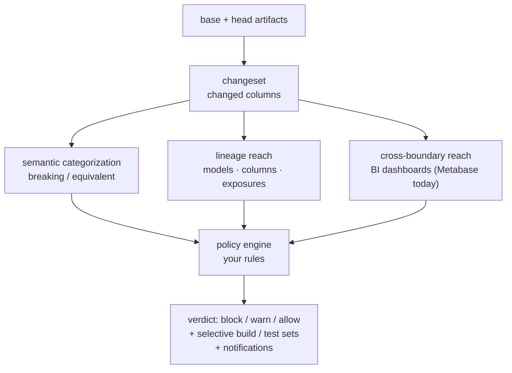

# From lineage tool to decision engine

parrant started as a **column-level lineage tool** — trace any column upstream and
down, and see a change's blast radius. It still does all of that. What's new is a layer *on
top* of the lineage: the tool now turns a pull request into a **change-impact decision**.

The organizing principle is **"diff cheaply, rebuild selectively."** The cost of assessing a
change should scale with the change's *true* blast radius, not with the size of your DAG.

!!! tip "New here? Start with the concepts"
    A few ideas below are non-obvious and easy to misread. Before the how-to guides, read
    **[How it works](concepts/how-it-works.md)** (the mental model), **[Guardrails &
    non-goals](concepts/guardrails.md)** (what it is *not*), and **[Things to
    know](concepts/gotchas.md)** (the subtleties that require knowledge).

## The four new capabilities

| Capability | The question it answers | Where |
|---|---|---|
| **Semantic categorization** | *Did this column's output actually change, or is the edit cosmetic?* | [Semantic categorization](semantic-categorization.md) |
| **Policy gate** | *Given my org's rules, should this change block, warn, or build/test something?* | [Policy gate guide](policy-gate.md) |
| **Cross-boundary (BI)** | *Will this column change break **that dashboard** — past dbt's edge?* | [Cross-boundary guide](metabase.md) |
| **Explorer surfacing** | *Show me all of the above, interactively.* | [Explorer](explorer.md) |

Together they turn the sticky PR comment from *"here is the blast radius"* into *"here is the
decision, and here is exactly what to rebuild."*

!!! tip "Every term, pinned in one place"
    A gate is only trustworthy if every label means exactly one thing across the code, the JSON,
    the explorer, and these docs. The **[Glossary](glossary.md)** is the single source of truth
    for the whole vocabulary — change kinds, semantic classes, reach kinds/mechanisms/precision,
    policy actions, gate decisions, and the fail-safe knobs.

## How the pieces fit

The tool diffs your base- and head-branch artifacts into a **changeset**, categorizes each
change and computes its **reach** (optionally [past dbt's edge into your BI layer](metabase.md)),
and your **[policy](policy-gate.md)** turns that into a verdict + a selective rebuild set — all
surfaced in the **[explorer](explorer.md)**. Each stage is explained in
[**How it works**](concepts/how-it-works.md).

## What has *not* changed (the guardrails)

These principles from the original tool still hold — the decision engine is built inside them, not
around them. The reasoning is in [**Guardrails & non-goals**](concepts/guardrails.md).

- **Offline, zero-credential** at gate time — artifacts only; it never runs dbt or your warehouse.
- **Metadata-agnostic** — the tool ships the engine; *you* ship the rules. No org taxonomy is hardcoded.
- **Expression classification, not value diffing** — it classifies the SQL expression, not the data.
- **Fail-safe** — anything not *proven* safe is treated as breaking.

## Backward compatibility

Everything here is **additive**. If you don't supply a `--policy` or `--metabase`, the tool
behaves exactly as before: the legacy `safe` / `review` / `block` verdict and the existing
`--fail-on none|tests|exposures|critical|any` gate are untouched. Adopt the new capabilities
one at a time.
