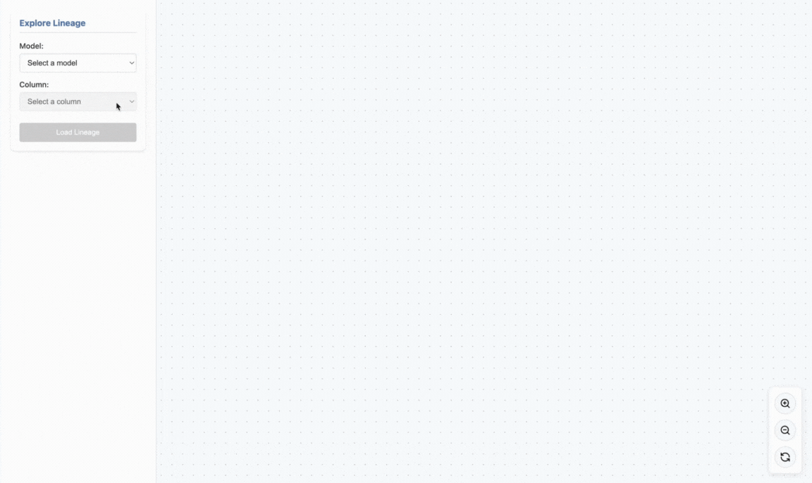

# DBT Column Lineage

Working with large dbt projects, I kept needing to understand **column-level data lineage** - is this column a simple projection, used in an aggregation, or what's the impact if I change it? So I built this tool to visualize it. Hopefully dbt core will add this feature one day, but until then, here's a simple solution.

## What is DBT Column Lineage?

DBT Column Lineage analyzes your dbt project artifacts (manifest & catalog) and compiled SQL to provide detailed insights into how data flows through your transformations at the column level.



## Features

<div class="grid cards" markdown>

-   :material-compass-outline:{ .lg .middle } __Interactive Explorer__

    ---

    A local web server with an intuitive UI to explore model and column lineage visually

-   :material-file-document-outline:{ .lg .middle } __Static Analysis__

    ---

    Generate DOT files for GraphViz or view lineage directly in the terminal

-   :material-target:{ .lg .middle } __Column-Level Lineage__

    ---

    Track which source columns contribute to each downstream column

-   :material-chart-line:{ .lg .middle } __Impact Analysis__

    ---

    Understand downstream effects of column changes before making them

</div>

## Quick Start

```bash
# Install
pip install dbt-col-lineage

# Start exploring
dbt-col-lineage --explore
```

[:octicons-arrow-right-24: Get Started](getting-started/quickstart.md){ .md-button .md-button--primary }

## Why Use Column-Level Lineage?

- **Impact Analysis**: Understand downstream effects of schema changes
- **Debugging**: Trace data issues to their source
- **Documentation**: Visualize complex data transformations
- **Data Governance**: Track sensitive data through your pipeline
